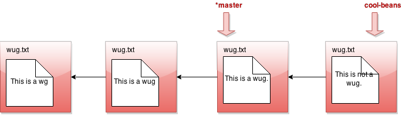

## branch

- __Usage__: `java gitlet.Main branch [branch name]`

- __Description__: Creates a new branch with the given name, and
  points it at the current head node. A branch is nothing more than a
  name for a reference (a SHA-1 identifier)
  to a commit node. This command does NOT immediately switch to the newly
  created branch (just as in real Git).
  Before you
  ever call branch, your code should be running with a default branch
  called "master".

- __Runtime__: Should be constant relative to any significant measure.

- __Failure cases__: If a branch with the given name already exists,
  print the error message `A branch with that name already exists.`

- __Dangerous?__: No

- __Our line count__: ~10

All right, let's see what branch does in detail. Suppose our state
looks like this:

Now we call `java gitlet.Main branch cool-beans`. Then we get this:

Hmm... nothing much happened. Let's switch to the branch with `java
gitlet.Main checkout cool-beans`:

Nothing much happened again?! Okay, say we make a commit now. Modify
some files, then `java gitlet.Main add...` then `java gitlet.Main commit...`

I was told there would be branching. But all I see is a straight line.
What's going on? Maybe I should go back to my other branch with `java
gitlet.Main checkout master`:

Now I make a commit...

Phew! So that's the whole idea of branching. Did you catch what's
going on? All that creating a branch does is to give us a new pointer. At any
given time, one of these pointers is considered the currently active
pointer, also called the HEAD pointer (indicated by \*). We can switch the
currently active head pointer with `checkout [branch name]`. Whenever
we commit, it means we add a child commit to the currently
active HEAD commit, even if a child commit is already there. This naturally
creates branching behavior, since one parent commit can have multiple children
commits.

Make _sure_ that the behavior of your `branch`, `checkout`, and
`commit` match what we've described above. This is pretty core
functionality of Gitlet that many other commands will depend upon. If
any of this core functionality is broken, very many of our autograder
tests won't work!
