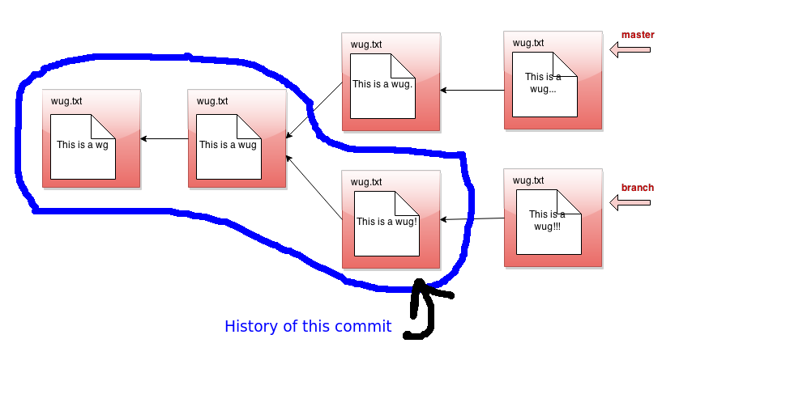

## log

- __Usage__: `java gitlet.Main log`

- __Description__: Starting at the current head commit, display
  information about each commit backwards along the commit tree until
  the initial commit, following the first parent commit links, ignoring any
  second parents found in merge commits.  (In regular Git, this is what
  you get with `git log --first-parent`).
  This set of commit nodes is called the commit's
  _history_. For every node in this history, the information it should
  display is the commit id, the time the commit was made, and the
  commit message. Here is an example of the _exact_ format it should
  follow:

           ===
           commit a0da1ea5a15ab613bf9961fd86f010cf74c7ee48
           Date: Thu Nov 9 20:00:05 2017 -0800
           A commit message.

           ===
           commit 3e8bf1d794ca2e9ef8a4007275acf3751c7170ff
           Date: Thu Nov 9 17:01:33 2017 -0800
           Another commit message.

           ===
           commit e881c9575d180a215d1a636545b8fd9abfb1d2bb
           Date: Wed Dec 31 16:00:00 1969 -0800
           initial commit

  There is a `===` before each commit and an empty line after it.
  As in real Git, each entry displays the unique SHA-1 id of the commit
  object. The timestamps displayed in the commits reflect
  the current timezone, not UTC; as a result, the timestamp for the initial
  commit does not read Thursday, January 1st, 1970, 00:00:00, but rather the
  equivalent Pacific Standard Time.
  Display commits with the most recent at the top. By the way, you'll find
  that the Java classes `java.util.Date` and `java.util.Formatter`
  are useful for getting and formatting times.
  Look into them instead of trying to construct
  it manually yourself!

  For merge commits (those that have two parent commits),
  add a line just below the first, as in

     ===
     commit 3e8bf1d794ca2e9ef8a4007275acf3751c7170ff
     Merge: 4975af1 2c1ead1
     Date: Sat Nov 11 12:30:00 2017 -0800
     Merged development into master.

  where the two hexadecimal numerals following "Merge:" consist of the first
  seven digits of the first and second parents' commit ids, in that order.
  The first parent is the branch you were on when you did the merge; the second
  is that of the merged-in branch. This is as in regular Git.

- __Runtime__: Should be linear with respect to the number of nodes in
  head's history.

- __Failure cases__: None

- __Dangerous?__: No

- __Our line count__: ~20

Here's a picture of the history of a particular commit. If the current
branch's head pointer happened to be pointing to that commit, log
would print out information about the circled commits:

The history ignores other branches and the future. Now that we have
the concept of history, let's refine what we said earlier about the
commit tree being immutable. It is immutable precisely in the sense
that _the history of a commit with a particular id may never change,
ever_. If you think of the commit tree as nothing more than a
collection of histories, then what we're really saying is that each
history is immutable.
