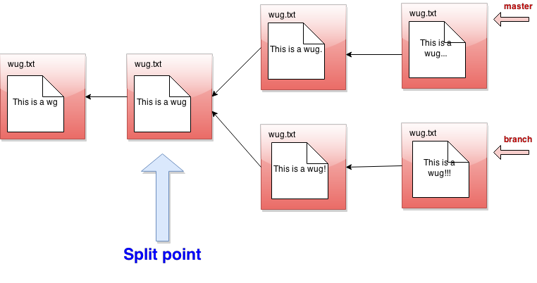

## merge

- __Usage__: `java gitlet.Main merge [branch name]`

- __Description__: Merges files from the given branch into the current
  branch. This method is a bit complicated, so here's a more detailed
  description:

    - First consider what might be called the _split point_ of the
      current branch and the given branch.
      For example, if `master` is the current branch and `branch` is the given
      branch:
      
      The split point is a _latest common ancestor_ of the current and given
      branch heads:
          - A _common ancestor_ is a commit to which there is a path
            (of 0 or more parent pointers) from both branch heads.
          - A _latest_ common ancestor is a common ancestor that is not an
            ancestor of any other common ancestor.
      For example, although the leftmost commit in the diagram above is a
      common ancestor of `master` and `branch`, it is also an ancestor of the
      commit immediately to its right, so it is not a latest common
      ancestor.
      If the split point _is_ the same commit as the given branch, then
      we do nothing; the merge is complete, and the operation ends with the
      message `Given branch is an ancestor of the current branch.`
      If the split point is the current branch, then the effect is to
      check out the given branch, and the operation
      ends after printing the message `Current branch fast-forwarded.`
      Otherwise, we continue
      with the steps below.

    - Any files that have been _modified_ in the given branch since
      the split point, but not modified in the current branch since
      the split point should be changed to their versions in the given
      branch (checked out from the commit at the front of the given
      branch). These files should then all be automatically staged.
      To clarify, if a file is "modified in the given branch since the
      split point" this means the version of the file as it exists in
      the commit at the front of the given branch has different
      content from the version of the file at the split point.

    - Any files that have been modified in the current branch but not
      in the given branch since the split point should stay as they
      are.

    - Any files that have been modified in both the current and
      given branch in the same way (i.e., both files now have the same
      content or were both removed) are left unchanged by the merge.
      If a file was removed from both the current and given branch, but a file
      of the same name is present in the working directory, it is left alone and
      continues to be absent (not tracked nor staged) in the merge.

    - Any files that were not present at the split point and are
      present only in the current branch should remain as they are.

    - Any files that were not present at the split point and are
      present only in the given branch should be checked out and
      staged.

    - Any files present at the split point, unmodified in the current
      branch, and absent in the given branch should be removed (and untracked).

    - Any files present at the split point, unmodified in the given branch,
      and absent in the current branch should remain absent.

    - Any files modified in different ways
      in the current and given branches are _in conflict_.  "Modified in
      different ways" can mean that the contents of both are changed and
      different from other, or the contents of one are changed and the other
      file is deleted, or the file was absent at the split point
      and has different
      contents in the given and current branches.  In this case, replace
      the contents of the conflicted file with

            <<<<<<< HEAD
            contents of file in current branch
            =======
            contents of file in given branch
            >>>>>>>

      (replacing "contents of..." with the indicated file's contents)
      and stage the result.
      Treat a deleted file in a branch
      as an empty file.  Use straight concatenation here.  In the case
      of a file with no newline at the end, you might well end up with
      something like this:

            <<<<<<< HEAD
            contents of file in current branch=======
            contents of file in given branch>>>>>>>

      This is fine; people who produce non-standard, pathological files
      because they don't know the difference between a line terminator
      and a line separator deserve what they get.

    - Once files have been updated according to the above, and the split
      point was not the current branch or the given branch,
      merge automatically commits with the log message
      `Merged [given branch name] into [current branch name].`
      Then, if the merge
      encountered a conflict,
      print the message `Encountered a merge conflict.` on the terminal (not
      the log).
      Merge commits differ from other commits: they record as parents
      both the head of the current branch (called the _first parent_)
      and the head of the branch given on the command line to be merged in.

    - There is one complication in the definition of the split point.  You
      may have noticed that we referred to "a", rather than "the"
      latest common ancestor. This is because there can be more than one in
      the case of "criss-cross merges", such as this:
      
      Here, the solid lines are first parents and the dashed lines are the
      merged-in parents.  Both the commits pointed by blue arrows above are
      latest common ancestors.  Here's how it was created:

            java gitlet.Main init
            java gitlet.Main branch branch
            [various edits...]
            java gitlet.Main commit "B"
            java gitlet.Main checkout branch
            [various edits...]
            java gitlet.Main commit "C"
            java gitlet.Main branch temp
            java gitlet.Main merge master  # Create commit F
            [various edits...]
            java gitlet.Main commit "H"
            java gitlet.Main checkout master
            [various edits...]
            java gitlet.Main commit "D"
            java gitlet.Main merge temp    # Create commit E
            [various edits...]
            java gitlet.Main commit "G"

      Now if we want to merge branch into master, we
      have two possible split points: the commits marked by the two blue
      arrows.  You might want to think about why it can
      make a difference which gets used as the split point.  We'll use the
      following rule to choose which of multiple possible split points to
      use:
          - Choose the candidate split point that is closest to the
            head of the current branch (that is, is reachable by following
            the fewest parent pointers along some path).
          - If multiple candidates are at the same closest distance, choose
            any one of them as the split point.  (We will make sure that this
            only happens in our test cases when the resulting merge commit
            is the same with any of the closest choices.)

      So in this example, we would choose commit C as the split point
      when merging `branch` into `master`, since there is a shorter path
      from G to C than from G to B.  If instead we were currently on
      `branch` and merging in branch `master`, we could use either commit
      B or C, since both are the same distance from commit H.

  By the way, we hope you've noticed that the set of commits has progressed
  from a simple sequence to a tree and now, finally, to a full
  directed acyclic graph.

- __Runtime__: $O(N\lg N + D)$, where $N$ is the total number
  of ancestor commits for the two branches and $D$ is the total amount of
  data in all the files under these commits.

- __Failure cases__: If there are staged additions or removals present,
  print the error message `You have uncommitted changes.` and exit.
  If a branch with the given name does not exist,
  print the error message `A branch with that name does not exist.` If
  attempting to merge a branch with itself, print the error message
  `Cannot merge a branch with itself.` If merge would generate an
  error because the commit that it does has no changes in it, just let
  the normal commit error message for this go through.

  If an untracked file in the current commit would be overwritten or
  deleted by the merge, print `There is an untracked file in the way;
  delete it, or add and commit it first.` and exit; perform this check
  before doing anything else.

- __Dangerous?__: Yes!

- __Differences from real git__:
  Real Git does a more subtle job of merging files, displaying conflicts only
  in places where both files have changed since the split point.

  Real Git has a different way to decide which of multiple possible split
  points to use.

  Real Git will force the user to resolve the merge
  conflicts before committing to complete the merge. Gitlet just
  commits the merge, conflicts and all, so that you must use a separate
  commit to resolve problems.

  Real Git will complain if there are unstaged changes to a file that
  would be changed by a merge.  You may do so as well if you want, but we
  will not test that case.

- __Our line count__: ~70
