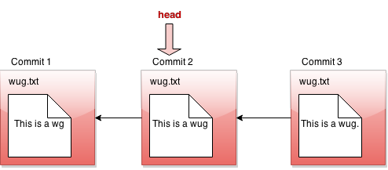

Overview of Gitlet
----

In this project you'll be implementing a version-control system that
mimics some of the basic features of the
popular system [Git](http://git-scm.com/).  Ours is
smaller and simpler, however, so we have named it Gitlet.

A version-control system is essentially a backup system for related collections
of files. The main functionality that Gitlet supports is:

1. Saving the contents of entire directories of files.
   In Gitlet, this is called _committing_, and the saved contents themselves are
   called _commits_.

2. Restoring a version of one or more files or entire commits.
   In Gitlet, this is called _checking out_ those files or that commit.

3. Viewing the history of your backups. In Gitlet, you view this
   history in something called the _log_.

4. Maintaining related sequences of commits, called _branches_.

5. Merging changes made in one branch into another.

The point of a version-control system is to help you when creating
complicated (or even not-so-complicated) projects, or when collaborating
with others on a project.
You save versions of the project periodically.
If at some later point in time you
accidentally mess up your code, then you can restore your source to
a previously committed version (without losing any of the changes
you made since then).  If your collaborators make changes embodied in a commit,
you can incorporate (_merge_) these changes into your own version.

In Gitlet, you don't just commit individual files at a time. Instead,
you can commit a coherent set of files at the same time. We like to think of
each commit as a _snapshot_ of your entire project at one point
in time. However, for simplicity, many of the examples in the
remainder of this document involve changes to just one file at a time.
Just keep in mind you could change multiple files in each commit.

In this project, it will be helpful for us to visualize the commits we
make over time. Suppose we have a project consisting just of the
file `wug.txt`, we add some text to
it, and commit it. Then we modify the file and commit these changes.
Then we modify the file again, and commit the changes again. Now we
have saved three total versions of this file, each one later
in time than the previous. We can visualize these commits like so:

Here we've drawn an arrow indicating that each commit contains some
kind of reference to the commit that came before it. We call the
commit that came before it the _parent commit_<--->this will be important
later. But for now, does this drawing look familiar? That's right;
it's a linked list!

The big idea behind Gitlet is that we can visualize the history of the
different versions of our files in a list like this. Then it's easy
for us to restore old versions of files. You can imagine making a
command like: "Gitlet, please revert to the state of the files at
commit #2", and it would go to the second node in the linked list and
restore the copies of files found there, while removing any files that are in the
first node, but not the second.

If we tell Gitlet to revert to an old commit, the front of the linked
list will no longer reflect the current state of your files, which
might be a little misleading. In order to fix this problem, we
introduce something called the _head_ pointer. The head pointer keeps
track of where in the linked list we currently are. Normally, as
we make commits, the head pointer will stay at the front of the linked
list, indicating that the latest commit reflects the current state of
the files:

However, let's say we revert to the state of the files at commit #2
(technically, this is the _reset_ command, which you'll see later in
the spec). We move the head pointer back to show this:

All right, now, if this were all Gitlet could do, it would be a pretty
simple system. But Gitlet has one more trick up its sleeve: it doesn't
just maintain older and newer versions of files, it can maintain
_differing_ versions. Imagine you're coding a project, and you have
two ideas about how to proceed: let's call one Plan A, and the other
Plan B. Gitlet allows you to save both versions, and switch between
them at will. Here's what this might look like, in our pictures:

It's not really a linked list anymore. It's more like a tree. We'll
call this thing the _commit tree_. Keeping with this metaphor, each of
the separate versions is called a _branch_ of the tree. You can
develop each version separately:

There are two pointers into the tree, representing the furthest
point of each branch. At any given time, only one of these is the
currently active pointer, and this is what's called the head pointer. The
head pointer is the pointer at the front of the current branch.

That's it for our brief overview of the Gitlet system! Don't worry if
you don't fully understand it yet; the section above was just to give
you a high level picture of what its meant to do. A detailed spec of
what you're supposed to do for this project follows this section.

But a last word here: commit trees are
_immutable_: once a commit node has been created, it can
**never** be destroyed (or changed at all). We can only add new things to
the commit tree, not modify existing things. This is an important
feature of Gitlet! One of Gitlet's
goals is to allow us to save things that we worked on in the past so we
don't delete them accidentally; this functionality would be jeopardized if
we were allowed to edit past commits.
