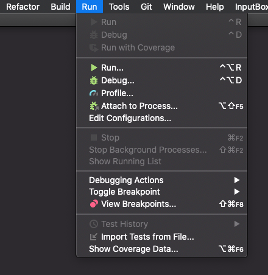

Testing
----

As usual, testing is part of the project.  Be sure to provide
your own acceptance tests for each of the commands, covering all the specified
functionality.  Also, feel free to add unit tests to `UnitTest.java` or other
testing classes it invokes in its `main` method. We don't provide any unit tests
for Gitlet since unit tests are very dependent on your implementation.

As with projects 0-2, the following commands will run your unit tests, acceptance
tests, or the entire testing suite respectively:

    make unit
    make acceptance
    make check

Furthermore, we've added an additional Makefile target:

    make doc

This command will generate a group of files based on your current project code that
represents the "design" of your code. For instance, if you have some class `A.java`
in your project, one of the files that `make doc` generates will be a file that clearly
names all of the methods, variables, and constants that you have so far in `A.java`.
Many more files are also created from this command, so try it out after you've written
some code and open the various files in a browser to see what's created!

If you'd like to run a single test, within the `testing` subdirectory, running
the command

    python3 tester.py --verbose FILE.in ...

where `FILE.in ...` is a list of specific `.in` files you want to check, will
provide additional information such as what your program is outputting.
The command

    python3 tester.py --verbose --keep FILE.in

will, in addition, keep around the directory that `tester.py` produces so
that you can examine its files at the point the tester script detected an
error.

In effect, the tester implements a very simple _domain-specific language (DSL)_
that contains commands to
- Set up or remove files from a testing directory;
- Run `java gitlet.Main`;
- Check the output of Gitlet against a specific output or a regular expression
  describing possible outputs;
- Check the presence, absence, and contents of files.

Running the command

    python3 testing/tester.py

(with no operands, as shown)
will provide a message documenting this language.
We've provided some examples in the directory `testing/samples`.  Don't
put your own tests in that subdirectory; place them somewhere distinct so you
don't get confused with our tests vs your tests (which may be buggy!). Put all
your `.in` files in another folder called `student_tests` within the `testing`
directory.

As usual, we will test your code _on the the instructional machines_, so do
be sure it works there!

We've added a few things to the Makefile to adjust for differences in people's
setups.  If your system's command for invoking Python 3 is simply `python`, you
can still use our makefile unchanged by using

    make PYTHON=python check

You can pass additional flags to `tester.py` with, for example,

    make TESTER_FLAGS="--show=all --keep"

### Debugging Acceptance Tests with IntelliJ

Lastly, we also have a way of using the IntelliJ debugger to debug
Gitlet acceptance tests. This may seem impossible, since we run
everything from the command line; however, IntelliJ provides a feature
called “Remote JVM Debugging” that will allow you to add breakpoints
that trigger during our acceptance tests.

A walk-through of the rest of these testing details can be found
[here](https://youtu.be/jO4lLWHHygs). This video goes over all the
steps listed here in the spec but for the Capers lab, so if you find
yourself confused on the directions then check it out. The
Capers lab was lab 6 in Spring 2021 when this video was made, but for
us it is lab 12.

Without JUnit tests, you may be wondering how to debug your code. We'll walk
you through how you will do that in Gitlet.

To debug an acceptance test, we first need to let IntelliJ know that
we want to debug remotely.  Navigate to your IntelliJ and open your
`proj3` project if you don't have it open already. At the top, go to
"Run" -> "Run":

You'll get a box asking you to Edit Configurations that will look like the
below:

Yours might have more or less of those boxes with other names if you tried
running a class within IntelliJ already. If that's the case, just click the one
that says "Edit Configurations"

In this box, you'll want to hit the "+" button in the top left corner and
select "Remote JVM Debug." It should now look like this:

We just need the default settings. You should add a descriptive name in the top
box, perhaps "Gitlet Remote Debug". After you add a name, go ahead and hit
"Apply" and then exit from this screen. **Before we leave IntelliJ**, place a
breakpoint in the `main` method of the `Main` class, so we can actually debug.
Make sure this breakpoint will actually be reached; just put it on the first
line of the `main` method.

Now you'll navigate to the `testing` directory within your terminal.
The script that will connect to the IntelliJ JVM is `tester.py` with the
`--debug` flag: use the following command to launch the testing script:

    python3 tester.py --debug samples/test01-init.in

If you wanted to run a different test, then simply put a different `.in` file.
If you'd like the `.gitlet` folder to stay after the test is completed to
investigate its contents, then use the `--keep` flag:

    python3 tester.py --keep --debug samples/test01-init.in

For our example it doesn't matter what you do; we've just included it in case
you'd like to take a look around. By default, the `.gitlet` that is generated
is deleted.

If you see an error message, then it means you are probably not in the `testing`
directory. Check those two things, and if you're still confused then ask a TA.

Otherwise, you should be ready to debug! You'll see something like this:

    test01-init: You are in debug mode.
        In this mode, you will be shown each command from the test case.
        If you would like to step into and debug the command, type 's'.
          Once you have done so, go back to IntelliJ and click the debug button.
        If you would like to move on to the next command, type 'n'.
    [line 3]: gitlet init
    >>>

The text above contains helpful tips. What we see next is the name of the `.in`
file we're debugging, then a series of lines that begin with `[line #]` and `>`.

Lines that begin with `[line #]` are the gitlet commands that will be run on your
`Main` class, i.e. a specific execution of your program. These correspond to the
commands we saw in the `.in` file on the right side of the `>`.

Lines that begin with `>>>` are for you to enter debug commands on. The 2
commands are listed above.

Remember that each input file will list multiple commands and therefore
multiple executions of our program. We need to first figure out what command
is the culprit.

Type in the single character "n" (short for "next") to execute this command
without debugging it. You can think of it as bringing you to the next command.

One of these will error: either your code will produce a runtime error, or
your output wasn't the same. For example:

    > python3 testing/tester.py --debug --keep testing/samples/test01-init.in

    test01-init: You are in debug mode.
        In this mode, you will be shown each command from the test case.
        If you would like to step into and debug the command, type 's'.
        Once you have done so, go back to IntelliJ and click the debug button.
        If you would like to move on to the next command, type 'n'.
    [line 3]: gitlet init
    >>> n
    ERROR (file or directory .gitlet not present)

    Ran 1 tests. 0 passed.

For us, it was our first command. Notice that we had the `--keep` flag
enabled, so we could now investigate the saved directory `test01-
init_0` to see what happened.  If we debugged again with the `--keep`
flag on the same test, we'll get a new directory `test01-init_1` and
so on.

Once you've found the command that errors, do it all again except now you can
hit "s" (short for "step") to "step into" that command, so to speak. Really
what happens is the IntelliJ JVM waits for our script to start and then
attaches itself to that execution. So after you press "s", you should hit the
"Debug" button in IntelliJ. Make sure in the top right the configuration is set
to the name of the remote JVM config you added earlier (this is why it is
helpful to give it a good name).

This will stop your program at wherever your breakpoint was as it's trying
to run that command you hit "s" on. Now you can use your normal debugging
techniques to step around and see if you're improperly reading/writing some
data or some other mistake.

You might get scenarios where the command you're debugging did
everything it was supposed to: in these cases, it
means you had a bug on a previous command with persistence. For example:
let's say your second invocation looks like it is doing everything correctly,
except when it tries to read the initial commit (that should have been
persistently stored in a file) it receives a blank file (or maybe the file
isn't even there). Then, even though the second execution of the program has
output that doesn't match the expected, it was really the previous (first)
execution that
has the bug since it didn't properly persist the data.

These are very common since persistence is a new and initially tricky concept,
so when debugging, your first priority is to find the execution that produced the
bug. If you didn't, then you would be debugging the second (non-buggy) execution
for hours to no avail, since the bug already happened.
